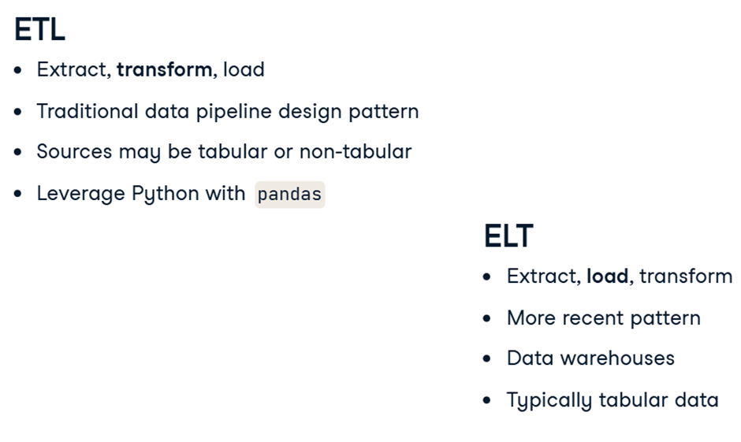

ETL is short for extract, transform, and load. ETL pipelines first extract data, before transforming it and loading it to a destination. ETL is the most traditional data pipeline design pattern, and may pull from tabular or non-tabular data sources. Typically, ETL pipelines use tools like Python and libraries such as pandas to manipulate and transform data.

